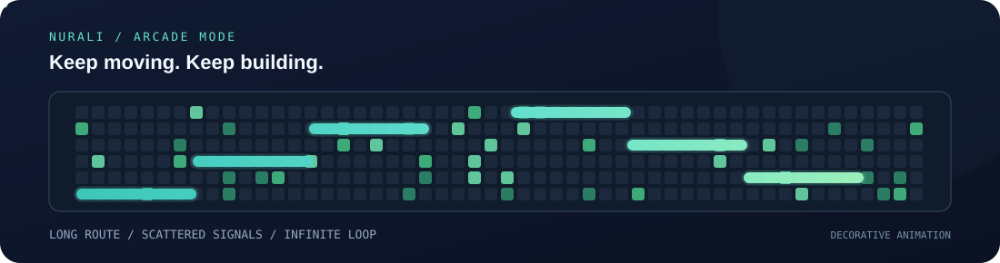

  

  # Hi, I'm Nurali 👋

  **IT student · Building practical tools for clearer decisions and smoother workflows**

  
  

---

### What I'm building

I work on web applications, configuration checks, and voice-assisted interfaces. I care about useful workflows, clear feedback, and testing what a prototype actually does.

| | Project | What you can explore |
|:--:|:--|:--|
| ◈ | **[DriftLens](https://github.com/NuraliKuzhagaliev/driftlens)** | A configuration release gate that checks required environment variables across application source, `.env.example`, and Compose configuration. Includes a browser UI, CLI, tests, and CI-friendly exit codes. |
| ◉ | **[SlotPilot](https://github.com/NuraliKuzhagaliev/slotpilot)** | A voice-assisted administrator for a demo auto service, built with Next.js and TypeScript. Appointment workflows use PostgreSQL/Supabase; the project README explains its current integration status and preview mode. |

### Tools behind the projects

**Languages & markup**

  

**Interfaces**

  

**Server & data**

---

### Arcade mode

  

---

  Observe the problem · Check the assumptions · Build the next step

